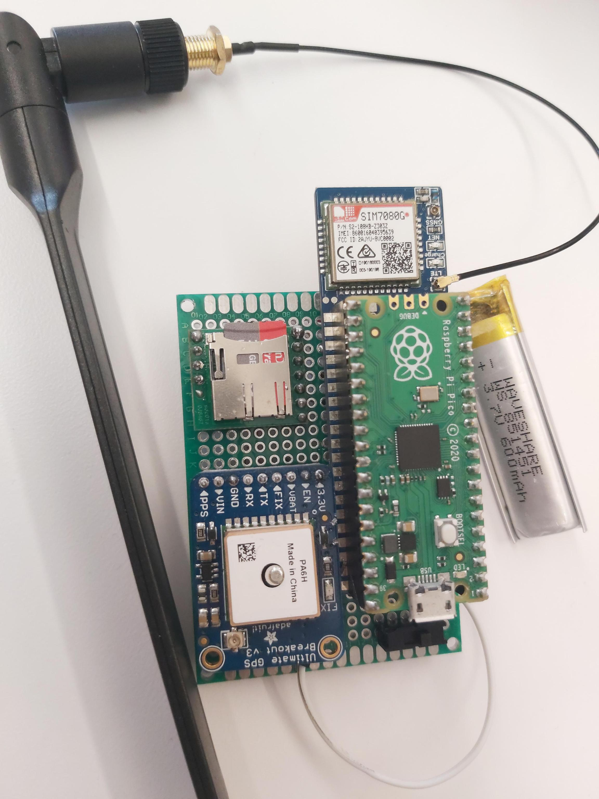

# Pico Tracking System

Micropython and Flask code to run your tracking system with a Raspberry Pi Pico and a webserver.

This project was developed by Elsa Tcheuyap, Guilherme Pita, Junyu Guo, Rusan Sharma, Shahriyar Habib and Yining Wang for the ESC204 Class at the University of Toronto in 2021. Feel free to use the asstes here, but follow the [license](LICENSE) and cite the source.

## Devices used

- Raspberry Pi Pico
- Adafruit GPS Ultimate Module
- SIMCom SIM7080G Module (battery and antenna included)
- Micro-SD Breakout (as well as a micro-sd card)
- Twilio Super Sim
- Breadboard

## Features

### Physical device

- Collects the device's location at periodic intervals, and stores the information locally in a micro SD card.
- Transmits location data and device performance using a SIM card to Web Interface.
- Fully independent and isolated position tracking system, with expandable battery for longer autonomy.
- Case designed to better protect the device. It stabilizes and secures the various electronics in place and shields them from the outside.

### Web interface

- Sends commands to the devices and receives information, such as battery percentage and current location.
- Creates a database of messages received from your devices
- Visualize the positions map using Google Maps to get insights on the use of the assets, with the data retrieved from the micro SD cards.

## Set-up

### Micropython

To use the [Micropython files](pico-code), you must first flash Micropython to your Raspberry Pi Pico; instructions on how to do this can be found [here](https://magpi.raspberrypi.com/articles/programming-raspberry-pi-pico-with-python-and-micropython).

Then, use [Thonny](https://thonny.org/) to connect your flashed Pico to your computer and transfer all the files on [pico-code](pico-code) to the root directory to it.

### Hardware

Follow the code above to connect the correct wires to the modules and the correct GPIO pins. If you want to post the detailed instructions to those connections, please create a pull request.

### Twillio

You must set up a Twillio account so send the messages to a url of your choice. This url must point to your web application.

### Web Interface

The web interface files are [here](webapp). It has been tested with Google Cloud. All Python libraries required are described [here](webapp/requirements.txt), remember to `pip install` or `pip3 install` them before deploying.
